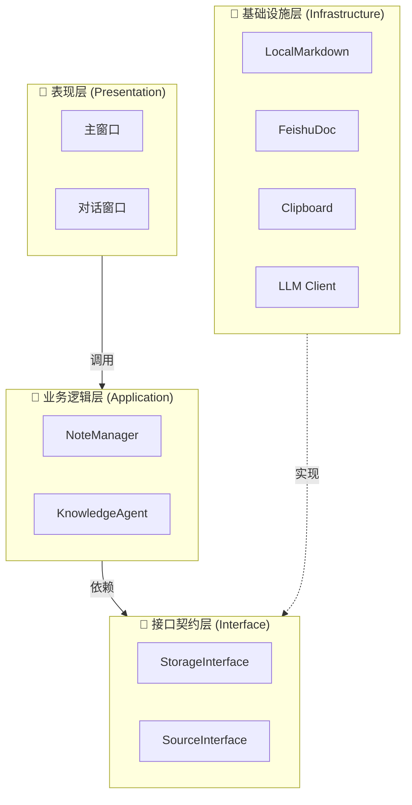

---

# 🏗️ FlashMemo 技术架构详解

FlashMemo 的代码库并非简单的脚本堆砌，而是严格遵循 **整洁架构 (Clean Architecture)** 与 **插件化设计** 的原则。系统被划分为职责清晰的层级，层与层之间通过**抽象接口**进行通信，最终由 UI 层统一调度。

这种设计确保了系统的高度解耦：**你可以随时更换存储引擎（如从本地换到 Notion），而无需修改任何一行 UI 或业务逻辑代码。**

---

## 0. 核心数据载体：The Note Entity

在 FlashMemo 中，**`Note` 类 (`backend/models.py`)** 是系统的“血液”。无论数据来自于剪贴板、OCR 还是 API，无论数据存储在本地 Markdown 还是飞书云文档，在业务逻辑层中，它们**全部**表现为统一的 `Note` 对象。

### 为什么这样设计？
传统的做法可能是直接传字典（Dict）或者 JSON，但我们定义了一个严格的数据类（DataClass）。

```python
@dataclass
class Note:
    id: str           # 全局唯一标识 (UUID)，确保跨平台同步时不冲突
    title: str        # 笔记标题 (文件名)
    content: str      # 核心内容 (Markdown 文本)
    tags: List[str]   # 标签系统 (用于文件夹分类和路由检索)
    
    # --- 面向未来的扩展字段 ---
    type: NoteType    # 模态类型 (TEXT, IMAGE, AUDIO)
    metadata: Dict    # 动态元数据容器
```

### 关键设计细节
1.  **`metadata` (动态容器)**：
    *   我们没有把所有字段都写死在类里。`metadata` 是一个字典，用于存储不同存储引擎特有的数据。
    *   *例如*：在飞书模式下，它存储真实的 `doc_name`；在本地模式下，它存储生成的 `filename`；未来做向量检索时，它可以存储 `embedding` 向量数据，而无需修改数据库 Schema。
2.  **`NoteType` (多模态预留)**：
    *   目前默认是 `TEXT`。但架构上已经支持扩展为 `IMAGE` 或 `AUDIO`。
    *   **预想场景**：未来用户截图粘贴，`ClipboardSource` 会生成一个 `type=IMAGE` 的 Note，存储层看到这个类型，就会自动把图片上传到飞书云空间，并在文档中插入 `<ImageBlock>`，而上层逻辑无需大改。

---

## 1. 宏观架构：模块与协作 (System Overview)

我们的系统可以看作由四个核心板块组成，它们通过 **“依赖注入” (Dependency Injection)** 的方式在 `main.py` 中组装。



### 协作流程
1.  **UI 层 (统一入口)**：这是用户感知的界面。它**不包含**任何复杂的业务逻辑（如怎么清洗数据、怎么存文件）。它只负责收集用户输入，然后调用 **业务逻辑层** 的方法。
2.  **业务逻辑层 (大脑)**：`NoteManager` 和 `KnowledgeAgent` 是系统的指挥官。它们接收 UI 的指令，编排数据流。**关键点在于：它们不知道数据存哪里，它们只知道调用“接口”。**
3.  **接口契约层 (协议)**：这是系统的**灵魂**。它定义了“保存笔记”、“搜索笔记”的标准动作。
4.  **基础设施层 (手脚)**：这是干脏活累活的地方。比如 `LocalMarkdownStorage` 负责写磁盘，`FeishuDocStorage` 负责调 API。它们都**实现**了接口契约。

---

## 2. 核心模块详解

### A. 接口契约层 (`backend/interfaces.py`)
这是整个架构中最稳定的部分。所有的扩展都必须遵守这里的规则。

*   **`StorageInterface`**：定义了所有存储后端必须具备的能力。
    *   `save(note)`: 保存。
    *   `load(tag)`: 读取。
    *   `list_files(tag)`: 列出摘要。
    *   `update(note)`: 更新。
*   **`SourceInterface`**：定义了数据从哪里来（目前是剪贴板，未来可以是 API Hook）。

> **💡 设计哲学 (Why?)**：
> 为什么要定义抽象基类 (ABC)？因为这实现了 **依赖倒置 (DIP)**。
> 上层业务逻辑只依赖这个抽象接口，而不依赖具体的 `local.py`。这意味着我们可以在写代码时完全忽略底层是文件还是数据库，甚至可以写一个 `MockStorage` 来做单元测试。

### B. 业务逻辑层 (`backend/manager.py` & `agent.py`)
这是“流水线”的定义者。

*   **`NoteManager`**：负责 **“录入流”**。它协调 Source 获取数据，清洗后封装成标准 `Note` 对象，再交给 Storage 保存。
*   **`KnowledgeAgent`**：负责 **“检索流”**。它利用 LLM 进行意图识别（Router），调用 Storage 获取上下文，再生成回答。

> **💡 设计哲学**：
> 这一层是**纯 Python 逻辑**，没有任何 UI 代码（PySide6）或 数据库代码（Requests/OS）。这保证了核心逻辑可以在任何环境下运行（比如未来你想做一个 Web 版，这一层代码可以直接复用）。

### C. 基础设施层 (`storage/`)
这是实现层，也是变化最频繁的地方。

*   **`LocalMarkdownStorage`**：
    *   **设计**：采用 **“文件夹即 Tag，文件即笔记”** 的结构。
    *   **Metadata**：使用 **YAML Front Matter** 存储元数据。这种设计让我们的数据具有极强的**通用性**——用户可以直接用 Obsidian 或 VS Code 打开笔记文件夹进行管理，没有任何 Vendor Lock-in（厂商锁定）。
*   **`FeishuDocStorage`**：
    *   **设计**：将笔记映射为飞书云文档。
    *   **Metadata**：巧妙地利用文档的 **首个 CodeBlock** 存储 JSON 元数据，实现了与本地 YAML 逻辑的同构。

### D. 表现层 (`ui/`)
这是用户交互的界面，采用了 **异步通信机制**。

*   **`worker.py` (QThread)**：
    *   所有的网络请求（飞书 API）、AI 生成、文件读写都被封装在 Worker 线程中。
    *   **为什么？** 为了保证 UI 的**极致流畅**。用户点击保存的瞬间，窗口立即消失（乐观反馈），繁重的上传任务交给后台线程慢慢跑。
*   **`widgets.py`**：
    *   自定义了 `TagSelector` 和 `FileSelector`，解决了复杂的交互冲突（如“既想下拉选择，又想自由输入”）。

---

## 3. 关键接口设计与决策 (Design Rationale)

在设计过程中，我们做出了几个关键的技术决策，这也是 FlashMemo 的亮点所在：

### 1. `list_files(tag) -> List[Dict]` 接口
为什么这个接口只返回 `{'id':..., 'name':...}` 这样的轻量级字典，而不直接返回 `Note` 对象？
*   **原因**：性能优化。
*   **场景**：当用户在“续写模式”选择文件时，飞书云端可能有几百个文档。如果我们为了列出文件名而下载所有文档的全文并解析，用户需要等几十秒。
*   **策略**：我们将“列出目录”和“读取内容”拆分。先用极快的速度拉取元数据列表，等用户真正选中某一个文件时，再异步加载全文。

### 2. `update(note)` 的“新建+删除”策略
为什么更新笔记时不直接覆盖内容，而是采用“删除旧文件 -> 创建新文件”？
*   **原因**：解决**一致性**问题。
*   **场景**：用户修改了笔记的 `Title`（文件名变了），或者修改了 `Tag`（文件夹变了）。
*   **策略**：如果我们只更新内容，那么旧的文件名/旧文件夹里的尸体文件会依然存在。采用 **Copy-on-Write (写时复制/重建)** 的策略，虽然稍微浪费一点网络资源，但能 100% 保证文件系统（或云端）的整洁和一致性，避免了复杂的差异比对逻辑。

### 3. `agent.chat` 的统一入口
为什么不区分 `search()` 和 `chat()` 两个接口？
*   **原因**：**自然语言的模糊性**。
*   **策略**：我们将决策权交给 LLM。用户输入“帮我找一下 Python 笔记”和“Python 怎么写”，对于传统程序是两个功能，但对于 LLM 都是 Prompt。我们设计了 `rag_router`，让 AI 自己判断用户是想“找东西”还是“问问题”，从而实现了极其自然的交互体验。

---

## 4. 面向未来的设计 (Future-Proofing)

为了未来可能的需求，我们预留了多个扩展点：

### A. 检索策略的抽象 (Strategy Pattern)
在 `backend/agent.py` 中，我们定义了 `RetrieverInterface`。
*   **当前实现**：`TagRouteRetriever`（利用 LLM 选 Tag，再遍历 Tag 文件夹）。这在数据量较小（<1000条）时非常精准且高效。
*   **未来扩展**：当笔记达到 10,000 条时，遍历文件会变慢。此时您只需写一个 `VectorRetriever`（对接 ChromaDB 或 Milvus），利用向量相似度检索。**`KnowledgeAgent` 的上层逻辑完全不用动，只需替换底层的 Retriever 实现即可。**

### B. 数据源的解耦 (Source Interface)
我们定义了 `CapturePayload` 类作为数据源的输出。
*   **当前实现**：`ClipboardSource` 从剪贴板读取文本。
*   **未来扩展**：
    *   **OCR 截图**：可以写一个 `ScreenshotSource`，调用 OCR 接口返回文字。
    *   **每日推送**：可以写一个 `RSSSource`，自动抓取订阅源。
    *   只要输出符合 `CapturePayload` 格式，`NoteManager` 都能照单全收。

---

## 5. 自定义开发指南 (Customization)

得益于上述架构，扩展 FlashMemo 非常简单。

### 想要支持新的存储引擎，例如 Notion / Obsidian / MySQL？
你不需要读懂 `ui/` 下的任何代码。
1.  在 `storage/` 下新建一个 `.py` 文件。
2.  继承 `backend.interfaces.StorageInterface`。
3.  实现 `save`, `load`, `list_files`, `update` 四个方法。
4.  在 `main.py` 的工厂方法里注册你的新类即可。

### 想要支持更多的数据获取来源？
1.  在 `backend/` 下新建一个 `.py` 文件。
2.  继承 `backend.interfaces.SourceInterface`。
3.  参考目前已有的代码，实现 `fetch()` 方法。
4.  在 `main.py` 的工厂方法里注册你的新类即可。

### 想要修改 AI 的性格，或自定义更精细的Prompt？
你不需要修改 Python 代码。
1.  进入 `prompts/` 文件夹。
2.  修改 `rag_summary.txt`。你可以告诉 AI：“请用鲁迅的语气回答问题”，或者“请只列出代码，不要废话”。
3.  重启程序，AI 的行为即刻改变。

---

通过这份文档，您不仅能了解 FlashMemo 是**如何**工作的，更能理解它**为什么**这样设计。我们相信，好的架构是软件生命力的源泉。